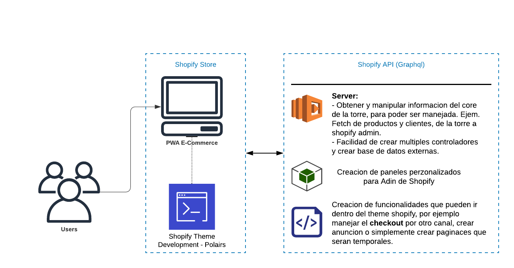

## SETUP 
- Obtener Shopify secret key
[Link](https://shopify.dev/tutorials/build-a-shopify-app-with-node-and-react/embed-your-app-in-shopify#get-a-shopify-api-key)
```js
const {
  SHOPIFY_API_SECRET_KEY,
  SHOPIFY_API_KEY,
  HOST,
} = process.env;
```

- Brindar acceso con Shopify Auth y agregar el [scope](https://shopify.dev/docs/admin-api/access-scopes) que va manejar,¡,
```js
  server.use(
    createShopifyAuth({
      apiKey: SHOPIFY_API_KEY,
      secret: SHOPIFY_API_SECRET_KEY,
      scopes: ['read_products'],
      afterAuth(ctx) {
        const { shop, accessToken } = ctx.session;

        ctx.redirect('/');
      },
    }),
  );
```

- Obtener los parametros de validacion de Shopify
Se debe crear una aplicacion dentre de shopify partners que debe estar configurada con la url de nuestra direccion y debe ser instalada,
prueba en tienda en desarrollo.


- Polairs
  https://polaris.shopify.com/

- Obtener datos del API de shopify
https://shopify-graphiql-app.shopifycloud.com/login


